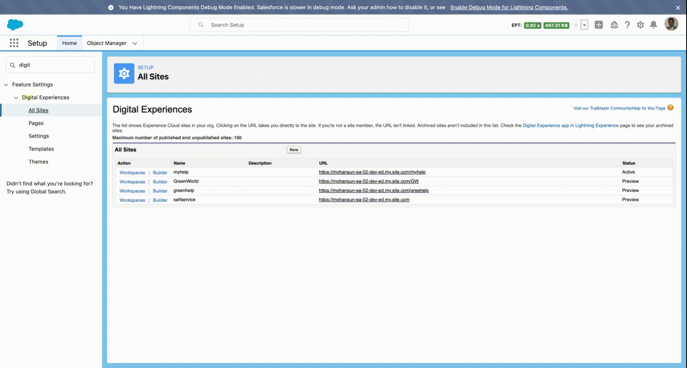

# Notes about PartnerPortal

## Playing with Experience Cloud
- 

- 

## Resources

- [Lightning Communities](https://mohan-chinnappan-n2.github.io/2019/cc/cc.html#Agenda)
- [Share CRM Data with Your Partners](https://trailhead.salesforce.com/content/learn/projects/communities_share_crm_data)

